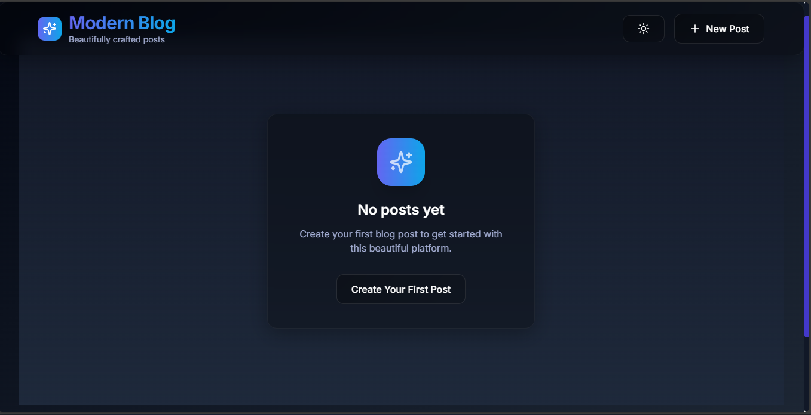
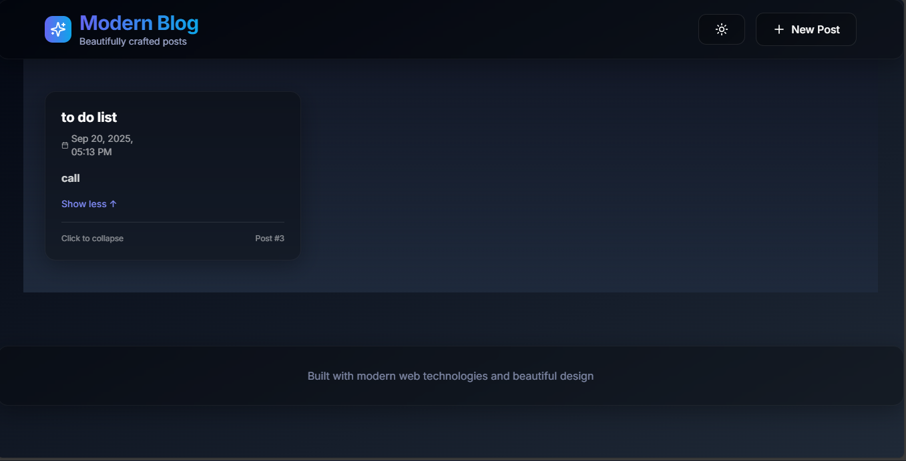
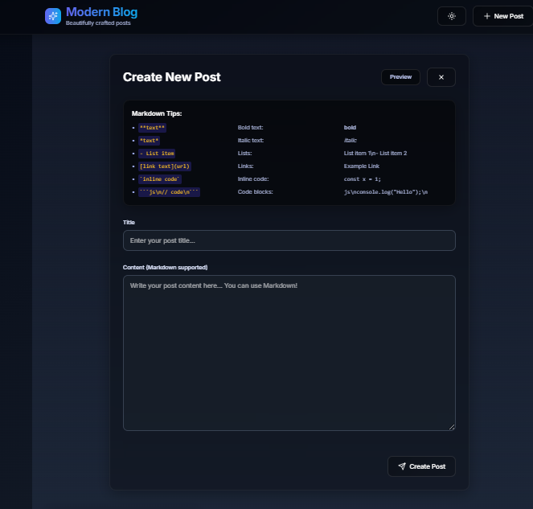

# Modern Blog Platform

This is a modern blogging platform built with a Next.js frontend and a Node.js/Express backend. It allows users to create, view, and edit blog posts with full Markdown support.

## Features

- **Create New Posts:** Easily compose new blog posts with a rich text editor that supports Markdown.
- **Markdown Preview:** See a live preview of your Markdown content as you type.
- **Edit Existing Posts:** Modify previously saved posts with the same intuitive editor.
- **Clear Markdown Tips:** Prominently displayed tips guide users on how to use Markdown effectively, with visual examples.
- **Responsive Design:** A sleek and modern user interface that adapts to various screen sizes.
- **Dark Mode Toggle:** Switch between dark and light themes for comfortable viewing.

## Setup Instructions

To get this project up and running on your local machine, follow these steps:

### Prerequisites

Make sure you have the following installed:

- Node.js (v18 or higher)
- npm (Node Package Manager) or yarn

### 1. Clone the Repository

```bash
git clone https://github.com/Dap42/modern-blog-platform.git
cd blogging-platform
```

### 2. Backend Setup

Navigate to the `backend` directory and install dependencies:

```bash
cd backend
npm install
# or yarn install
```

Start the backend server:

```bash
npm run dev
# or yarn dev
```

The backend server will typically run on `http://localhost:5000`.

### 3. Frontend Setup

Open a new terminal, navigate to the `frontend` directory, and install dependencies:

```bash
cd frontend
npm install
# or yarn install
```

Start the frontend development server:

```bash
npm run dev
# or yarn dev
```

The frontend application will typically run on `http://localhost:3000`.

## Usage

Once both the frontend and backend servers are running:

1.  Open your browser and go to `http://localhost:3000`.
2.  You can create new posts using the "New Post" button.
3.  Existing posts will be displayed on the homepage. You can click on a post to expand its content.
4.  To edit a post, click the "Edit" icon on the post card.
5.  To delete a post, click the "Trash" icon on the post card.

## Screenshots

### Home Screen



### List of Notes



### Note Creation


